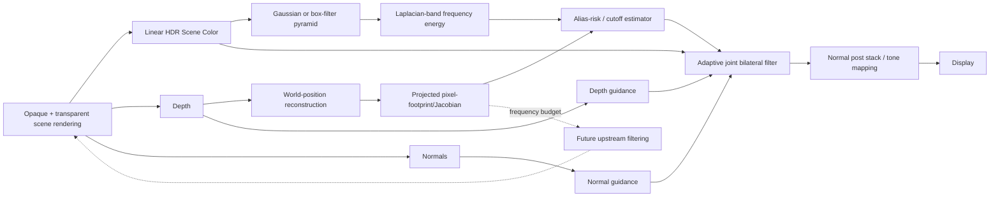
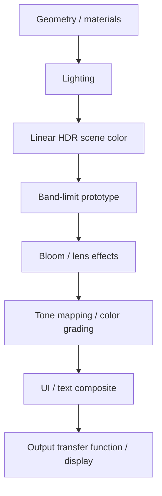
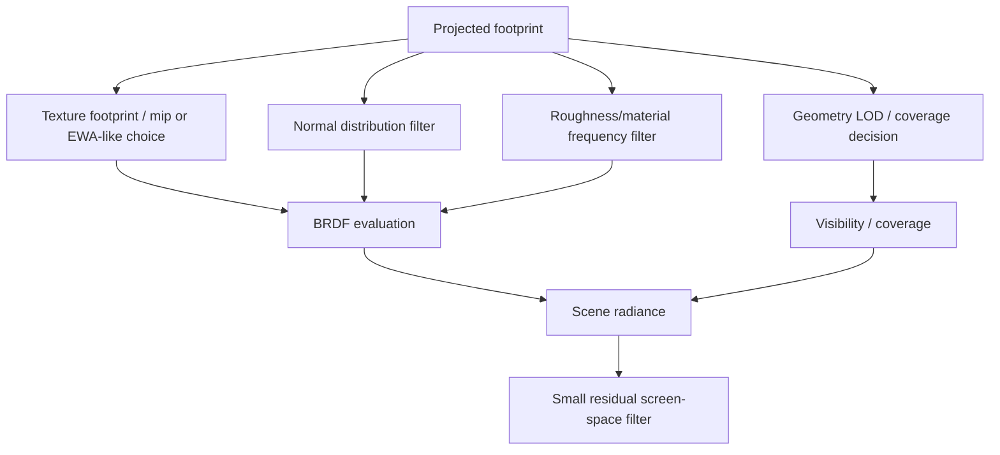
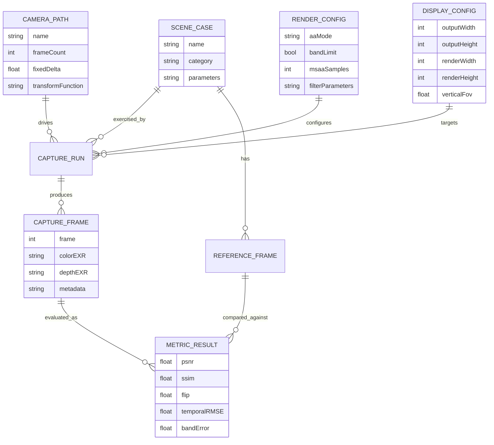

# Depth-Aware, Display-Resolution–Aware Band-Limited Rendering: Implementation and Evaluation Plan

## Executive summary

The proposed idea is technically sound as a **rendering architecture hypothesis**, with one important refinement:

> The goal should not be “blur increasingly with depth.” The goal should be to ensure that the spatial-frequency content delivered to a sampling stage does not substantially exceed the frequency that stage can represent.

Depth is useful because perspective determines how world-space detail projects onto pixels, but **depth alone is not the signal that determines filtering strength**. A large, flat, low-frequency object at 100 m may need no filtering, while a glossy normal-mapped surface at 10 m may contain severe subpixel frequencies. The correct abstraction is therefore a **projected pixel footprint plus signal-frequency budget**, with depth, projection, surface orientation, output resolution, material frequency, and eventually geometry coverage all contributing.

This places the project directly in the lineage of mipmapping and texture prefiltering. Williams's *Pyramidal Parametrics* introduced pyramidal prefiltering specifically to reduce aliasing caused by sampling texture detail at inadequate resolution. Toksvig extended the idea to normal maps by observing that the length of an averaged normal encodes information about normal variation. LEAN mapping went further by storing normal-distribution moments so that unresolved bump structure can be represented as a broader reflectance distribution rather than simply disappearing. Later normal-distribution filtering work explicitly attacked high-frequency glossy shading. citeturn8search0turn20search12turn8search2turn20search2

The most important research conclusion is that a **full-screen post-process version cannot be the final solution**. Once a high-frequency signal has been undersampled and aliases into a lower frequency, a post-process does not possess enough information to determine which apparent low-frequency pattern is real and which is folded aliasing. The screen-space prototype should therefore be treated as a **measurement platform and proof of concept**. Its job is to answer:

1. Can projected-footprint information reliably predict regions likely to be unstable?
2. Can output-resolution-dependent filtering measurably reduce shimmer while retaining perceptually valid detail?
3. Which classes of aliasing respond to screen-space filtering?
4. Which classes require intervention earlier in the pipeline?
5. Is there enough quality gain per millisecond to justify moving the concept upstream?

The recommended development sequence is:

**Unity URP → upstream material experiments → UE5 stress test → optional custom research renderer.**

Unity URP is the best starting environment because current URP exposes depth, normals, color and motion information to custom/full-screen passes; current RenderGraph APIs support custom `ScriptableRenderPass` implementations; and URP provides native SMAA, TAA, and MSAA baselines. Unity's documentation explicitly distinguishes MSAA's triangle-edge role from shader aliasing such as texture/specular aliasing, which is almost exactly the distinction this project needs to investigate. citeturn1search0turn14search1turn14search2turn6search4

The prototype should progress through five research stages:

| Milestone | Primary question | Deliverable | Estimated effort* | Complexity |
|---|---|---|---:|---|
| **V0 — Measurement foundation** | Can we correctly map depth/projection/output resolution to a world-space pixel footprint? | Unity URP project, depth reconstruction, footprint/Jacobian visualizer, deterministic camera harness | 3–5 engineer-days | Low–medium |
| **V1 — Screen-space band-limit prototype** | Can an adaptive, edge-aware spatial filter reduce visible aliasing without indiscriminate blur? | HDR pyramid, frequency-energy maps, joint bilateral reconstruction, resolution-aware cutoff, automated captures | 8–15 days | Medium |
| **V2 — Upstream signal filtering** | Can we prevent aliasing rather than repair it? | Material-frequency control, normal→roughness/NDF filtering, texture-footprint experiments, MSAA hybrid | 15–30 days | High |
| **V3 — UE5 stress test** | Does the approach remain useful beside Nanite/Lumen/TSR? | UE implementation, native/TSR comparisons, Nanite and Lumen matrices, Unreal profiling | 10–20 days for prototype; more for renderer-source integration | High |
| **V4 — Custom research renderer** | What happens when the architecture itself is designed around frequency budgets? | Minimal Vulkan/DX12 renderer with analytic coverage/NDF experiments | 30–60+ days | Very high |

\*Assumes one graphics programmer already comfortable with HLSL and either Unity rendering or comparable GPU APIs. These are planning ranges, not schedule promises.

The strongest likely eventual architecture is not:

```text
render aliased scene
        ↓
resolution-aware blur
        ↓
display
```

but:

```text
                         target sampling footprint
                                   │
              ┌────────────────────┼─────────────────────┐
              ▼                    ▼                     ▼
        texture filter       normal/NDF filter      geometry/coverage
              │                    │                     │
              └────────────────────┼─────────────────────┘
                                   ▼
                              BRDF / lighting
                                   │
                                   ▼
                         residual spatial filtering
                                   │
                                   ▼
                        light temporal reconstruction
                                   │
                                   ▼
                                display
```

That distinction is central. Mipmapping, LEAN, filtered normal distributions, and pixel-aware geometry systems such as Nanite all point toward **representing unresolved structure statistically or aggregately before final sampling**, rather than allowing arbitrary frequencies to fight over individual pixels. Epic's current Nanite documentation even states the design principle that drawing vastly more triangles than pixels is generally pointless; Nanite uses fine-grained LOD to keep rendered triangle counts related to screen resolution. citeturn17view1

My recommendation is therefore to pursue the project, but evaluate it as **display-aware band-limited rendering**, not as a replacement post-process AA algorithm. A successful result may still use MSAA or analytical coverage for silhouettes and a weak temporal reconstruction stage for temporal sampling, while substantially reducing the amount of unstable information those systems must repair.

## Technical foundations and related work

The central problem is classical sampling theory. A sampled image cannot uniquely represent arbitrary spatial frequencies. If frequencies above the sampling limit enter the rasterization process, they can fold into lower frequencies—aliasing—rather than merely disappearing. Real-time rendering has historically addressed different classes of that problem with different techniques.

**Mipmapping is the closest conceptual ancestor.** Williams's 1983 *Pyramidal Parametrics* described pyramidal prefiltering and sampling as a method for reducing aliasing while changing the resolution at which texture data is represented. The important conceptual lesson is not merely “use smaller textures farther away”; it is that the representation should be **prefiltered for its projected sampling footprint before being sampled**. citeturn8search0turn20search19

Conventional texture derivatives already approximate this idea for texture coordinates. What your proposal adds is the question:

> What if the *whole rendered scene*—geometry, normals, roughness, highlights, shadows and procedural detail—were required to respect an output-dependent frequency budget in the same way textures approximately do?

That is much more ambitious.

**Normal maps expose why ordinary averaging is insufficient.** A set of microscopic surface normals can average toward the macro normal, but the disappearing directional variation should still affect the reflected-light distribution. Toksvig's normal-map filtering work exploits the fact that averaging unit normals produces a shortened resultant when the normals vary; that shortening carries information that can be used to broaden the specular response. citeturn20search12

LEAN mapping represents additional statistical information—mean and second moments of the slope distribution—so filtered normal-map detail can be converted into an effective anisotropic reflectance distribution rather than simply normalized back into one direction. LEADR extends related ideas to displacement and reflectance filtering. citeturn8search2turn20search20

Han, Sun, Ramamoorthi and Grinspun formulated normal-map filtering in the frequency/distribution domain, while Kaplanyan, Hill, Patney and Lefohn later focused explicitly on filtering normal distributions for shading antialiasing. These works are especially relevant because they identify **high-frequency glossy response**, rather than only geometric jaggies, as a major sampling problem. citeturn20search1turn20search2

This is exactly where a screen-space blur is least physically satisfying. Consider two groups of unresolved microfacets:

```text
Resolved surface:

     /\/\ /\//\/\//\/\
----/---\/--------\----- macro plane

At distance, individual slopes disappear.
```

The correct limit is not necessarily:

```text
one perfectly flat normal
```

but rather:

```text
macro normal
+
distribution of unresolved slopes
=
broader, stable BRDF lobe
```

That is why **normal-to-roughness conversion should be one of the earliest upstream experiments**.

**Joint bilateral filtering is useful as an experimental reconstruction tool.** Bilateral and joint/cross-bilateral techniques use spatial proximity together with a guidance signal to prevent smoothing indiscriminately across important discontinuities; joint bilateral upsampling is a canonical example of using another signal as guidance. citeturn21search0turn21search4

For this project, depth and normals are natural guidance channels:

\[
w_{ij}=w_s(i,j)\,w_z(i,j)\,w_n(i,j)
\]

so that the algorithm can filter high-frequency color within a surface without naïvely mixing foreground and background.

**MSAA solves a different problem.** Khronos's Vulkan documentation describes MSAA as testing several coverage locations inside a pixel and resolving those samples; ordinary MSAA does not shade every sample independently, so it is primarily effective for primitive coverage boundaries rather than arbitrary high-frequency interior shading. citeturn22search0 Unity's URP documentation similarly notes that MSAA handles spatial/triangle-edge aliasing but not shader aliasing such as texture or specular aliasing. citeturn6search4

This makes MSAA a potentially excellent **partner** rather than competitor:

\[
\boxed{\text{MSAA/coverage for silhouettes} +
\text{band-limiting for shading/material detail}}
\]

Historically, area-based visibility methods such as Carpenter's A-buffer represented fragment coverage inside the pixel and area-averaged contributions instead of relying on a single binary center sample. That is a useful conceptual model for the eventual V4 renderer, although implementing exact visibility/coverage for arbitrary overlapping geometry is much harder than a conventional post-process. citeturn22search2

**SMAA is a useful spatial baseline, not a direct substitute.** SMAA is an image-based morphological antialiaser intended to reconstruct edge patterns and can combine morphological AA with additional sampling strategies. It does not systematically prefilter arbitrary shader/material frequency before rasterization. citeturn15search5turn15search11

**TAA and TSR attack aliasing with samples distributed in time.** Contemporary temporal AA uses current and historical samples, motion information, rejection logic and reconstruction to increase the effective sample set. Epic's temporal-upscaler architecture explicitly combines current and previous-frame information, and TSR additionally serves as an upscaler between render and display resolution. citeturn1search17turn17view2 Unity similarly describes TAA as using a color history and warns that temporal accumulation can introduce ghosting. citeturn6search4

This is why your hypothesis should not initially be phrased as “TAA is unnecessary.” A stronger falsifiable hypothesis is:

> **If upstream spatial frequencies are restricted to what the current sampling footprint can represent, temporal reconstruction should have less unstable information to suppress, permitting lower history dependence and potentially reducing blur/ghosting.**

That can actually be measured.

A useful conceptual comparison is:

| Technique | Triangle/silhouette edges | Texture/shader aliasing | Specular aliasing | Temporal shimmer | Needs history | Typical failure mode |
|---|---:|---:|---:|---:|---:|---|
| SMAA | Good for recognized edges | Limited | Limited | Limited | No | Missed patterns / residual shimmer |
| MSAA | **Strong** | Weak | Weak | Helps geometric edge stability | No | Interior shader aliasing survives |
| TAA | Strong | Strong-ish through accumulation | Strong-ish | **Strong** | **Yes** | Blur, ghosting, disocclusion instability |
| TSR | Strong + reconstruction/upscale | Strong-ish | Strong-ish | **Strong** | **Yes** | Reconstruction/ghosting tradeoffs |
| Proposed V1 post filter | Moderate, but should avoid boundaries | Moderate | Moderate | Potentially good | No | Overblur; cannot undo folded aliases |
| Proposed upstream V2 | Depends on coverage strategy | **Strong target** | **Strong target** | **Strong target** | No | Requires material/renderer integration |
| MSAA + upstream band-limit | **Strong** | **Strong target** | **Strong target** | Strong | No | Cost/integration complexity |
| Band-limit + light TAA/TSR | Strong | Strong | Strong | Potentially strongest | Yes | Can overfilter before temporal reconstruction |

The phrase **display-resolution-aware** also needs careful definition. There are potentially two resolutions:

\[
R_r=(W_r,H_r)
\]

for internal render resolution and

\[
R_o=(W_o,H_o)
\]

for output/display resolution.

At native rendering:

\[
R_r=R_o
\]

and the problem is straightforward.

With a temporal upscaler:

\[
R_r<R_o
\]

and there are two separate sampling boundaries. You cannot simply allow frequencies up to the output Nyquist limit when the scene is first rasterized at a lower internal resolution; they can alias *before* the upscaler ever sees them. Conversely, a reconstruction method may exploit jittered temporal samples to recover information beyond a single internal-resolution frame. Epic explicitly distinguishes “render resolution” and “display resolution” at different locations in the TSR/post-process chain. citeturn17view2

For the first experiments, therefore:

> **Disable dynamic resolution and upscaling. Set render resolution equal to output resolution.**

Only after V1 behaves predictably should the experiment separate those two variables.

Finally, foveated-rendering literature is conceptually relevant even though VR should be excluded from this project. Microsoft's *Foveated 3D Graphics* demonstrated the broader principle that the rendering workload and sampling density can be allocated according to perceptual spatial requirements rather than uniformly. citeturn23search0 The relevant lesson here is not eye tracking; it is that **the optimal rendered signal is a function of what the observer/display can resolve**. For the non-VR prototype, output resolution is enough. Physical screen size and viewing distance can become optional later parameters. NVIDIA's FLIP metric is interesting in that regard because it explicitly models viewing distance and monitor pixel size when evaluating perceptual differences between rendered images. citeturn22search1

## Prototype architecture and shader design

The first implementation should be **Unity URP, RenderGraph-based, linear HDR**, with a custom `ScriptableRendererFeature` and `ScriptableRenderPass`. Current Unity documentation supports custom RenderGraph passes and exposes active renderer resources through frame data; URP full-screen passes can request depth, normal, color and motion inputs. citeturn14search1turn14search2turn1search0

The initial render flow should look like this:



For the first clean experiment, disable TAA, FXAA, SMAA, motion blur, depth of field, film grain, chromatic aberration, sharpening, dynamic resolution and upscaling. Fixed exposure is strongly recommended. Those systems can be restored one at a time for comparisons.

Unity can reconstruct a world-space point from screen UV, sampled depth and the inverse view-projection matrix via `ComputeWorldSpacePosition`. Unity's own URP example uses `_ScaledScreenParams`, `SampleSceneDepth`, reversed-Z handling, and `UNITY_MATRIX_I_VP`. citeturn24search0

A basic reconstruction helper is therefore:

```hlsl
float3 ReconstructWorld(float2 uv)
{
    float depth = SampleSceneDepth(uv);

#if !UNITY_REVERSED_Z
    depth = lerp(UNITY_NEAR_CLIP_VALUE, 1.0, depth);
#endif

    return ComputeWorldSpacePosition(
        uv,
        depth,
        UNITY_MATRIX_I_VP
    );
}
```

For bilateral depth comparison, keep a **linear eye-space depth** representation as well. Do not use raw hardware/device depth differences directly as though they were metric distances because perspective depth is generally non-linear.

### Projected pixel footprint

For a simple front-facing surface at view-space depth \(z\), vertical world-space coverage per output pixel is approximately

\[
s_y(z)=
\frac{2z\tan\left(\frac{\theta_y}{2}\right)}{H_o}
\]

where:

- \(z\) is view-space depth,
- \(\theta_y\) is vertical FOV,
- \(H_o\) is output height.

Similarly,

\[
s_x(z)=
\frac{2z\tan\left(\frac{\theta_x}{2}\right)}{W_o}
\]

This is excellent as a sanity check.

For a 60° vertical FOV, 2160-pixel output and \(z=10\,\mathrm m\),

\[
s_y \approx
\frac{20\tan 30^\circ}{2160}
\approx 0.00535\,\mathrm m
\]

or approximately

\[
5.35\ \mathrm{mm/output\ pixel}.
\]

However, the fronto-parallel equation loses information on surface orientation and footprint anisotropy. A better implementation reconstructs neighboring world positions:

\[
P=P(u,v)
\]

\[
P_x=P(u+\Delta u,v)
\]

\[
P_y=P(u,v+\Delta v)
\]

and estimates

\[
\mathbf d_x=P_x-P,
\qquad
\mathbf d_y=P_y-P.
\]

If those neighbors represent **render-resolution pixels**, convert them to an output-pixel-equivalent footprint:

\[
\mathbf d_x^{(o)}
=
\mathbf d_x\frac{W_r}{W_o}
\]

\[
\mathbf d_y^{(o)}
=
\mathbf d_y\frac{H_r}{H_o}.
\]

At native rendering these factors are 1.

Rather than reducing the footprint immediately to one scalar radius, construct

\[
J=
\begin{bmatrix}
| & |\\
\mathbf d_x^{(o)}&\mathbf d_y^{(o)}\\
| & |
\end{bmatrix}
\]

and its 2×2 metric:

\[
G=J^TJ
=
\begin{bmatrix}
\mathbf d_x\cdot\mathbf d_x &
\mathbf d_x\cdot\mathbf d_y\\
\mathbf d_y\cdot\mathbf d_x &
\mathbf d_y\cdot\mathbf d_y
\end{bmatrix}.
\]

The eigenvalues of \(G\),

\[
\lambda_{\max},\lambda_{\min},
\]

give squared principal footprint dimensions:

\[
s_{\text{major}}=\sqrt{\lambda_{\max}},
\qquad
s_{\text{minor}}=\sqrt{\lambda_{\min}}.
\]

The footprint area is approximately

\[
A_p=
\left|
\mathbf d_x^{(o)}
\times
\mathbf d_y^{(o)}
\right|.
\]

This gives you something much more useful than distance:

```text
                         world-space pixel footprint

close / frontal                    distant / grazing
┌──┐                                   ╱──────────╲
│  │                                   ╲──────────╱
└──┘

small + isotropic                   large + anisotropic
```

Recommended HLSL-like pseudocode:

```hlsl
struct PixelFootprint
{
    float majorWorld;
    float minorWorld;
    float areaWorld2;
    float anisotropy;
};

PixelFootprint EstimateFootprint(
    float2 uv,
    float2 renderSize,
    float2 outputSize)
{
    float2 dUV = 1.0 / renderSize;

    float3 p  = ReconstructWorld(uv);
    float3 px = ReconstructWorld(uv + float2(dUV.x, 0));
    float3 py = ReconstructWorld(uv + float2(0, dUV.y));

    float3 dx = px - p;
    float3 dy = py - p;

    // Convert render-pixel footprint to output-pixel footprint.
    dx *= renderSize.x / outputSize.x;
    dy *= renderSize.y / outputSize.y;

    float a = dot(dx, dx);
    float b = dot(dx, dy);
    float c = dot(dy, dy);

    float disc = sqrt(max(
        0.0,
        (a - c) * (a - c) + 4.0 * b * b
    ));

    float lambdaMax = 0.5 * (a + c + disc);
    float lambdaMin = 0.5 * (a + c - disc);

    PixelFootprint r;
    r.majorWorld = sqrt(max(lambdaMax, 0.0));
    r.minorWorld = sqrt(max(lambdaMin, 0.0));
    r.areaWorld2 = length(cross(dx, dy));
    r.anisotropy = r.majorWorld /
                   max(r.minorWorld, 1e-6);

    return r;
}
```

There is a major caveat: at a silhouette, `Px` or `Py` may lie on an entirely different surface. That can make the apparent footprint explode. Therefore the estimator needs an **edge-validity test**:

\[
\frac{|z_j-z_i|}
{\max(z_i,\epsilon)}
<\tau_z
\]

and

\[
N_i\cdot N_j>\tau_n.
\]

When a neighbor fails, use a one-sided derivative, shader derivative where safe, or the analytical depth/FOV formula as a fallback.

This should be the very first thing validated in V0.

### Multi-scale frequency detector

A useful V1 representation is a Gaussian/mipmap-like pyramid of scene color:

\[
L_0,L_1,L_2,\ldots,L_n
\]

where \(L_0\) is full resolution and each following level is properly low-pass filtered and downsampled by two.

Define a Laplacian-like band:

\[
B_l =
L_l -
\uparrow(L_{l+1})
\]

where \(\uparrow\) denotes filtered upsampling to level \(l\).

The energy at scale \(l\) can be measured from luminance:

\[
E_l=
\left|Y(B_l)\right|
\]

or preferably squared energy,

\[
E_l=
Y(B_l)^2.
\]

For HDR scenes, the **detector** may benefit from compressed/log luminance:

\[
Y' = \log(1+kY)
\]

so one bright specular sample does not numerically dominate the entire decision. The actual image filtering should still operate on linear HDR radiance/color.

You can then derive, for example,

\[
R_\text{fine}
=
\frac{\sum_{l=0}^{k}E_l}
{\epsilon+\sum_{l=0}^{n}E_l}
\]

to estimate what fraction of local contrast resides in the finest bands.

A simple alias-risk function for V1 could be:

\[
A_\text{risk}
=
R_\text{fine}
\cdot
g(s_{\text{major}},s_{\text{minor}})
\cdot
C_\text{edge},
\]

where \(g\) maps footprint conditions into desired suppression and \(C_\text{edge}\) is a confidence mask that falls near uncertain depth boundaries.

Do **not** interpret this as a mathematically exact alias detector. A post-raster image cannot reliably distinguish an originally valid low-frequency signal from a high-frequency signal that has already folded into the same frequency. V1 is deliberately a heuristic instrument.

A more direct alternative is to use the pyramid to choose an adaptive reconstruction level:

\[
\ell =
\log_2(r)
\]

and interpolate between levels:

\[
C_\text{filtered}
=
(1-t)L_{\lfloor\ell\rfloor}
+tL_{\lceil\ell\rceil}.
\]

The bilateral stage then prevents that low-pass operation from indiscriminately crossing surfaces.

### Joint depth/normal-aware filtering

For center sample \(i\) and neighbor \(j\), use:

\[
w_{ij}
=
w_s\,w_z\,w_n.
\]

Spatial Gaussian:

\[
w_s=
\exp
\left(
-\frac{
\|\mathbf p_i-\mathbf p_j\|^2
}{
2\sigma_s^2
}
\right).
\]

For depth, use linear eye depth \(z\). A relative form behaves better across large depth ranges:

\[
d_z=
\frac{|z_i-z_j|}
{\max(z_i,\epsilon)}
\]

\[
w_z=
\exp
\left(
-\frac{d_z^2}{2\sigma_z^2}
\right).
\]

For normals:

\[
d_n=
1-\max(0,N_i\cdot N_j)
\]

\[
w_n=
\exp
\left(
-\frac{d_n}{\sigma_n}
\right).
\]

The output is

\[
C'_i=
\frac{\sum_j w_{ij} C_j}
{\epsilon+\sum_j w_{ij}}.
\]

A production version should probably add a material/roughness discriminator:

\[
w_m =
\exp(-k_r|r_i-r_j|)
\]

or an explicit material-ID rejection, because two adjacent materials can have similar depth and normal while requiring completely different frequency behavior.

This is strongly analogous to the edge-preserving role of joint bilateral methods, although the proposed weighting and use case here are your research design rather than a reproduction of the original joint-bilateral algorithm. citeturn21search0

### Normal-to-roughness conversion

Do not do this:

```hlsl
normal = normalize(FilteredNormal);
```

and throw away the amount by which it shrank.

Instead compute a filtered **unnormalized mean**:

\[
\mathbf m=E[N].
\]

Its magnitude

\[
r=\|\mathbf m\|
\]

is close to one when all normals agree and decreases as orientation variation increases. That is the fundamental observation behind Toksvig-style filtering. citeturn20search12

For a first empirical implementation define:

\[
v_n=
\max(0,1-r)
\]

or a more aggressive proxy

\[
v_n=
\frac{1-r}{\max(r,\epsilon)}.
\]

If the renderer's microfacet parameter is \(\alpha\), use an experimentally calibrated relationship such as:

\[
\alpha_\text{eff}^2
=
\alpha_\text{base}^2
+k\,v_n
\]

\[
\alpha_\text{eff}
=
\sqrt{\alpha_\text{eff}^2}.
\]

This should be labelled **Toksvig-inspired**, not “the Toksvig formula.” Tune \(k\) against the supersampled reference.

The next level is LEAN-like filtering: store first and second moments of normal slopes and derive a covariance/distribution from the filtered moments. LEAN was specifically designed to represent normal-map filtering and specular appearance together. citeturn8search2

Ultimately, a filtered NDF approach is more principled than merely increasing one isotropic roughness scalar, especially for anisotropic detail. citeturn20search2

### Geometric coverage

The proposed frequency system should **not** be expected to solve all silhouettes.

If a perfectly smooth diagonal edge cuts through output pixels, something must integrate its area coverage. MSAA is the easiest initial answer. Khronos describes MSAA as storing/evaluating several pixel coverage locations and resolving them, while noting that ordinary MSAA does not increase shading samples for fully covered interior pixels. citeturn22search0

Therefore test:

\[
\text{band-limit only}
\]

versus

\[
4\times\text{ MSAA}+\text{band-limit}.
\]

Unity URP does not permit its built-in TAA and MSAA simultaneously, so those should be separate experimental branches there. citeturn6search4

Analytical area coverage is a V4 question. One possible research method is to clip a projected triangle polygon against each pixel square and integrate visible area, conceptually related to area-based/A-buffer approaches. citeturn22search2 The difficulty is not merely computing one triangle's overlap; it is robust visibility among multiple subpixel fragments, transparency, intersections and shading variation.

### Pass placement and color pipeline

For V1 in URP, place the primary filter **before normal post-processing and tone mapping**, after the scene data you intend to filter are available. Current URP full-screen infrastructure has injection points including “Before Rendering Post Processing,” and can request depth, normal and color requirements. citeturn6search0

Use linear HDR buffers. Unity's current documentation states that when HDR is used in linear mode, rendering occurs in floating-point linear-space buffers and post-processing/blending on those buffers operates in linear space before final output conversion. citeturn15search4turn15search22

That matters because averaging gamma-encoded values is not physically equivalent to averaging linear radiance.

The desirable ordering is approximately:



Keep bloom **after** the band-limit stage. A one-pixel HDR highlight that should physically integrate into a broader subpixel contribution can otherwise produce bloom first, after which filtering is solving a different signal.

Keep UI, HUD text and intentionally pixel-designed content outside the experiment.

### Debug visualizations

V0/V1 should expose these as selectable full-screen debug modes:

| Debug view | Purpose |
|---|---|
| Raw device depth | Verify depth availability/reversed-Z assumptions |
| Linear eye depth | Verify metric comparisons |
| Reconstructed world position | Detect matrix/UV errors |
| Major footprint axis | Show world units per output pixel |
| Minor footprint axis | Reveal anisotropy |
| Footprint area | Show projected sampling density |
| Anisotropy ratio | Identify grazing-angle cases |
| Pyramid mip selected | Verify resolution-dependent cutoff |
| Fine-band energy | Identify high-frequency regions |
| Alias-risk estimate | Show where filtering activates |
| Depth rejection | Detect cross-surface filtering |
| Normal rejection | Detect crease protection |
| Bilateral weight sum | Find unstable/undersupported pixels |
| Normal resultant length | Show unresolved normal variance |
| Effective roughness | Verify normal→roughness transfer |
| Temporal residual | Localize shimmer over motion |
| Reference error/FLIP map | Distinguish stabilization from correctness |

A simple footprint visualization should map **logarithmic** world units per pixel rather than raw values because the depth range can span orders of magnitude:

```text
small footprint                                  large footprint
high resolvable detail                           low resolvable detail

  blue-ish concept → green → yellow → red concept
       1 mm/px       1 cm/px   10 cm/px    1 m/px

Do not hard-code those colors into the algorithm;
they are merely a debug legend.
```

## Experimental roadmap and implementation plan

The project should be treated as a sequence of falsifiable research questions rather than one large rendering feature.

### Milestone schedule and versioned deliverables

| Version | Scope | Concrete deliverables | Exit criterion | Effort | Risk |
|---|---|---|---|---:|---|
| **V0** | Measurement/infrastructure | Unity URP project pinned to one version; depth reconstruction; linear-depth output; world-position output; pixel-footprint/Jacobian shader; output-resolution parameter; deterministic camera rails; EXR capture | Footprint agrees with analytical FOV calculation within expected discretization error on planar surfaces; changes correctly with resolution/FOV/depth | 3–5 days | Low–medium |
| **V1** | Screen-space proof of concept | HDR color pyramid; Laplacian/frequency-energy detector; depth/normal bilateral filter; cutoff/risk view; 720p–4K matrix; SMAA/TAA/MSAA baselines; metric pipeline | At least some known aliasing cases show lower temporal/reference error than raw/SMAA without unacceptable in-band detail loss | 8–15 days | Medium |
| **V2** | Move filtering upstream | Explicit texture footprint/mip experiments; normal resultant/roughness conversion; LEAN/NDF test material; optional anisotropic footprint; MSAA hybrid; material ID guidance | Specular/normal-map torture scenes move closer to supersampled reference *before* postfilter, with less shimmer and less screen-space blur | 15–30 days | High |
| **V3** | UE5 port/stress test | Post-process prototype; RDG implementation if necessary; Nanite on/off matrix; Lumen on/off; TSR native/upscaled comparisons; Unreal Insights data | Technique retains measurable advantage or reveals exactly which modern UE subsystems make it redundant | 10–20+ days | High |
| **V4** | Custom research renderer | Minimal Vulkan/DX12 renderer; glTF; deterministic camera; G-buffer/HDR; analytic coverage experiment; explicit NDF/material prefilter pipeline | Ability to test pre-raster frequency budgets without engine constraints | 30–60+ days | Very high |

Current Unity RenderGraph documentation and sample projects provide examples for blits, materials, compute passes, G-buffer visualization, output textures and temporary resources, making them good scaffolding for V0/V1 rather than writing a renderer from scratch. citeturn14search1turn14search2

**V0 should contain almost no image “beautification.”** The only goal is trustworthy measurement.

Suggested validation objects:

```text
flat plane facing camera
flat plane rotated 30°
flat plane rotated 60°
flat plane rotated 80°
same plane at z = 1, 2, 5, 10, 20, 50, 100 m
```

At each distance, compare measured footprint against:

\[
\frac{2z\tan(FOV/2)}{H}.
\]

Then repeat:

```text
720p
1080p
1440p
2160p
```

The world footprint should halve when output resolution doubles along the corresponding dimension.

**V1 answers whether screen-space stabilization has value.** Keep the design deliberately simple:

```text
HDR scene color
       ↓
four- or five-level pyramid
       ↓
band-energy estimate
       ↓
resolution / footprint weighting
       ↓
5×5 or 7×7 depth-normal-aware filter
       ↓
output
```

Do not begin with a huge kernel, machine learning, history buffer or exotic reconstruction. Those would make failures difficult to interpret.

**V2 is the scientifically important milestone.** At this stage split the algorithm into different signal classes:



This is where the project transitions from “smart blur” into a genuinely interesting renderer architecture.

Texture experiments should include explicit LOD selection:

\[
\lambda
\approx
\log_2
\left(
\max(
\|\partial \mathbf u/\partial x\|,
\|\partial \mathbf u/\partial y\|
)
\right)
\]

and compare the GPU's ordinary derivative-driven result with a footprint constrained by the **target output sampling rate**.

At grazing angles, the footprint becomes strongly anisotropic. Ordinary isotropic mip selection throws away too much information. The eventual model should therefore preserve both principal footprint axes and consider anisotropic/EWA-like filtering rather than reducing everything to one radius.

**V3 should not merely port the effect to UE.** It should test whether the hypothesis remains useful in a renderer that already has aggressive geometry LOD and temporal reconstruction.

Current Epic documentation states that Nanite uses fine-grained LOD and aims to keep rendered geometric complexity related to screen pixels; aggregate geometry such as leaves and grass is specifically identified as difficult because distant disconnected pieces behave more like a partially opaque aggregate than a continuous simplifiable surface. citeturn17view1 That makes foliage one of the most valuable UE tests.

Nanite's “Preserve Area” behavior is particularly conceptually interesting: when simplification would remove disconnected foliage elements, it redistributes lost area into remaining geometry to combat thinning. citeturn17view1 That is closely aligned with the broader principle behind your proposal:

> unresolved structures should become an aggregate representation that preserves their macroscopic effect rather than randomly appearing and disappearing.

**V4 should be a research renderer, not a new game engine.**

Keep it to approximately:

```text
Vulkan or DirectX 12
SDL/GLFW
Dear ImGui
glTF loader
shader hot reload
basic PBR
depth + normal + motion buffers
FP16 HDR
deterministic camera
GPU timestamps
capture system
```

No gameplay framework, networking, physics, full editor, scripting ecosystem or asset pipeline beyond what experiments require.

That lets you study exact coverage, explicit texture integration and NDF filtering without spending months reproducing unrelated engine infrastructure.

The data model for the whole experiment can be kept simple:



That may look excessive for a graphics experiment, but it prevents one of the most common problems in visual rendering tests: screenshots get generated without enough metadata to reproduce exactly what created them.

## Test scene, ground truth, and automated evaluation

The scene should be intentionally pathological rather than visually attractive. Each test object should represent a **specific signal class**, and its dimensions should be known in world units.

Use these baseline camera/render parameters:

| Parameter | Initial value |
|---|---:|
| Vertical FOV | 60° |
| Near plane | 0.1 m |
| Far plane | 200 m |
| Fixed simulation interval | 1/60 s |
| Capture frame rate | 60 frames/s |
| Exposure | Fixed |
| Dynamic resolution | Off |
| Upscaling | Off for primary tests |
| Motion blur | Off |
| DOF | Off |
| Bloom | Off initially; enabled later |
| Film grain | Off |
| Sharpening | Off |
| Camera jitter | Off except TAA/TSR baseline |
| Random seeds | Fixed |

The primary output matrix should be:

\[
1280\times720
\]

\[
1920\times1080
\]

\[
2560\times1440
\]

\[
3840\times2160.
\]

These resolutions should not merely resize the same capture afterward. Render and evaluate the scene separately at each target.

### Exact torture cases

| Case | Construction | What it tests | Expected measurable outcome |
|---|---|---|---|
| **Checkerboard wall** | Planar checks at 5, 10, 20, 40 mm across 5–100 m | Known spatial frequency versus depth | Proposed method approaches reference gray/low-frequency limit without prematurely destroying resolvable checks |
| **Grazing checker floor** | Same patterns, plane viewed around 75–85° incidence | Anisotropic footprint | Isotropic filter visibly overblurs; anisotropic footprint should improve later V2 |
| **Line comb** | Vertical bars procedurally sized to project to 0.25, 0.5, 1, 2 and 4 pixels at target depth | Sampling threshold and edge coverage | V1 reduces shimmer but cannot fully solve disappearing subpixel geometry; MSAA improves edge cases |
| **Fence/railings** | Repeated cylinders/slats receding 5–100 m | Repetitive geometry aliasing | Hybrid MSAA/band-limit should outperform color filter alone |
| **Cable bundle** | 2, 5, 10 mm cylinders against contrasting background | Tiny silhouette stability | Reveals limits of post filtering and need for coverage/aggregate representation |
| **Normal-frequency panel** | Sinusoidal/tiled normal detail at 16, 64, 256 cycles/m; roughness 0.03, 0.1, 0.3 | Specular shimmer | Normal→roughness/NDF V2 should dramatically lower temporal error versus V1 |
| **Roughness-frequency panel** | 1–4 mm alternating roughness bands | BRDF parameter aliasing | Material prefilter should outperform scene-color blur |
| **Metal glint field** | Dense high-frequency normals on near-mirror material | Extreme highlight instability | TAA baseline likely stabilizes; NDF filtering should reduce source instability before TAA |
| **Foliage** | Alpha cards and geometric leaves, static first | Aggregate/subpixel geometry | Strong stress case; expect remaining aliasing where geometry disappears before filter |
| **Deterministic foliage motion** | Fixed sinusoidal wind after static tests | Geometry + motion | Tests temporal robustness without randomness |
| **Depth-discontinuity pole** | Thin pole around 5 m with detailed wall around 50 m | Bilateral edge protection | No color halo/bleeding across pole boundary |
| **Rotating spoke wheel** | Fine radial spokes, slow fixed angular velocity | Orientation-dependent aliasing | Strong temporal/frequency stress; reveals whether stability comes from blur |
| **Emissive point array** | Tiny bright features from <1 to 4 px | HDR high-frequency energy | Must conserve approximate integrated energy rather than clamp/disappear |
| **Material boundary** | Coplanar adjacent materials with same depth/normal | Limitation of depth/normal guidance | Demonstrates need for material-ID/roughness guidance |

For line tests, do not hardcode arbitrary world thicknesses. Compute them from the target projected size. From

\[
s_y(z)=
\frac{2z\tan(\theta_y/2)}{H},
\]

a feature intended to be \(p\) pixels tall at depth \(z\) should have approximately

\[
h=p\,s_y(z).
\]

Thus you can procedurally build exact 0.25-, 0.5-, 1-, 2- and 4-pixel objects for every resolution.

### Camera rails

Use at least three deterministic paths.

**Forward rail**

\[
P(t)=(0,\;1.6,\;-10+80t)
\]

with

\[
t\in[0,1]
\]

over 10 seconds/600 frames. Orientation is fixed along +Z.

This continuously crosses spatial-frequency thresholds.

**Lateral rail**

\[
P(t)=(-10+20t,\;1.6,\;25)
\]

over 10 seconds/600 frames, looking toward a fixed scene target such as

\[
(0,\;1.6,\;45).
\]

This is particularly good for fences, checkerboards and repetitive material patterns because features slide subpixel distances across the raster.

**Micro-motion path**

Hold translation fixed and use:

\[
yaw(t)
=
1^\circ
\sin
\left(
2\pi t/4\text{ s}
\right)
\]

for several cycles.

This deliberately produces tiny sample-grid movement and makes shimmer easy to quantify.

Compute camera transform **directly from frame index**, rather than numerically integrating velocity:

```csharp
double t = frameIndex / 60.0;
camera.transform.position = EvaluatePosition(t);
camera.transform.rotation = EvaluateRotation(t);
```

That avoids run-to-run integration drift.

### Ground-truth reference

The ground truth should approximate the **area-integrated target pixel**, not merely “a prettier AA mode.”

The primary reference method should be high-resolution spatial supersampling.

For target dimensions

\[
W\times H
\]

render

\[
N W \times N H
\]

with no TAA and no post AA.

For 1080p, an 8× linear supersample gives:

\[
15360\times8640.
\]

That is expensive but appropriate for selected reference sequences or cropped torture tests.

Then downsample each \(N\times N\) block in **linear HDR**:

\[
C_{xy}
=
\frac{1}{N^2}
\sum_{i=0}^{N-1}
\sum_{j=0}^{N-1}
C^{hi}_{Nx+i,Ny+j}.
\]

Apply exactly the same tone mapping/output transform **after** downsampling.

This box-area average is deliberately simple: each high-resolution sample represents a subdivision of the output pixel aperture. For especially pathological patterns, verify convergence by comparing 4×, 8× and selected 16× crops. If the 8× reference meaningfully changes at 16×, it was not yet a trustworthy reference.

A second useful reference is an **8×8 stratified subpixel accumulation** at target resolution:

\[
C=
\frac1{64}\sum_{k=1}^{64} C_k
\]

with simulation time frozen for the frame and camera samples distributed over an 8×8 pixel grid.

That can be cheaper in framebuffer memory and is useful for geometry coverage, but it is not perfectly equivalent to rendering at genuinely higher spatial resolution because texture derivatives and LOD selection can differ. Therefore use high-resolution/downsample as the primary spatial reference and jittered accumulation as a cross-check.

### Quantitative metrics

No single metric should determine success.

**PSNR**

For mean squared error

\[
MSE=
\frac1N\sum_i(I_i-R_i)^2,
\]

\[
PSNR=
10\log_{10}
\left(
\frac{MAX^2}{MSE}
\right).
\]

Useful for gross numerical comparison, but blur can sometimes improve MSE while destroying useful detail.

**SSIM**

SSIM compares structural luminance/contrast information rather than simply squared pixel error and remains a useful full-reference image metric. The original Wang–Bovik–Sheikh–Simoncelli paper is the canonical reference. citeturn15search3

**FLIP**

FLIP is highly relevant to rendering research because it was designed for differences between rendered images and high-quality references and produces perceptually oriented error maps. NVIDIA provides source implementations and reports that the metric incorporates display/viewing considerations. citeturn22search1

For this project, record:

\[
\text{mean FLIP}
\]

and the 95th-percentile FLIP error, not just a single global average.

**Spatial-band error**

Because your algorithm explicitly manipulates spatial frequency, this may be one of the most informative custom measurements.

Build identical Laplacian pyramids for result \(I\) and reference \(R\):

\[
E_l^\text{band}
=
\frac1N
\sum
\left|
B_l(I)-B_l(R)
\right|^2.
\]

This tells you whether an algorithm:

- leaves excessive high-frequency aliasing,
- removes correct fine detail,
- shifts energy into the wrong scale.

A filter that scores well temporally merely because it blurs everything should fail here.

**Motion-compensated temporal error**

For motion warp \(W\),

\[
\Delta I_t=
I_t-W(I_{t-1})
\]

and

\[
\Delta R_t=
R_t-W(R_{t-1}),
\]

define

\[
D_t=
\Delta I_t-\Delta R_t.
\]

Then

\[
tRMSE=
\sqrt{
E[D_t^2]
}.
\]

This removes much of the legitimate temporal change present in the reference and focuses on **extra change introduced by the rendering algorithm**.

Use depth consistency to exclude disocclusions:

\[
|z_t-W(z_{t-1})|>\tau
\quad\Rightarrow\quad
\text{exclude pixel}.
\]

**Shimmer/flicker spectral metric**

For motion-compensated luminance residual

\[
e_t(x)=Y(I_t)-Y(R_t)
\]

along a tracked surface point or region, compute a temporal DFT:

\[
E(f)=\mathcal F_t[e_t].
\]

Define an experimental shimmer score such as:

\[
S=
\frac{
\sum_{f=f_1}^{f_2}|E(f)|^2
}{
\epsilon+\sum_f|E(f)|^2
}.
\]

At 60 Hz, a practical inspection range might be roughly 2–30 Hz. This metric should be clearly labelled **project-specific**, not a validated perceptual standard.

You should also report the absolute residual power, because a ratio alone could be misleading.

**Temporal coverage stability**

For the fence/cable tests, integrate luminance or coverage across a narrow ROI containing the feature:

\[
Q_t=\sum_{x\in ROI} Y(x,t).
\]

Then report

\[
\sigma_Q.
\]

An ideal subpixel representation should vary much less than a binary appear/disappear rasterization while preserving the reference mean contribution.

**Ghosting error**

For TAA/TSR baselines, separately evaluate recently disoccluded pixels. Otherwise a temporal technique can appear stable simply because old information is incorrectly retained.

### Automated harness

Every run should be defined by a small immutable configuration:

```json
{
  "scene": "NormalFrequencyPanel",
  "cameraPath": "Lateral",
  "output": [1920, 1080],
  "render": [1920, 1080],
  "fovY": 60.0,
  "aa": "None",
  "bandLimit": true,
  "filterPreset": "V1_03",
  "fixedDelta": 0.0166666667,
  "seed": 12345
}
```

Each capture folder should contain approximately:

```text
metadata.json
color_000000.exr
color_000001.exr
...
depth_*.exr            optional
normal_*.exr           optional
motion_*.exr           optional
gpu_timings.csv
metrics.csv
```

The harness should automatically iterate:

```text
scene case
× camera path
× resolution
× AA method
× band-limit configuration
× relevant material setting
```

For TAA, use the engine's normal deterministic jitter sequence/history. For the no-history proposed method, use an unjittered camera. For proposed + TAA, let TAA own the jitter rather than independently jittering the band-limit stage.

The important result is not one screenshot. It is a reproducible dataset such as:

```text
checkerboard / lateral / 1080p
--------------------------------------
Raw        mean FLIP ...
SMAA       mean FLIP ...
TAA        mean FLIP ...
MSAA4x     mean FLIP ...
DARB-V1    mean FLIP ...
MSAA+DARB  mean FLIP ...
Reference  0
```

with temporal metrics over the complete frame sequence.

## Performance, failure modes, and UE5/custom-renderer port

### Performance profiling

Profile in a standalone build whenever possible rather than relying on Editor timings. Unity's GPU profiler documentation explicitly notes Editor overhead and states that GPU timing support depends on platform/API; it provides a hierarchical breakdown of GPU cost. citeturn17view3

A useful procedure is:

1. Warm up the scene for roughly 300 frames.
2. Run a fixed 1,000-frame measurement path.
3. Record median, mean and p95 GPU time.
4. Profile each resolution independently.
5. Add GPU markers around pyramid generation, frequency classification and filtering.
6. Repeat each configuration several times if variance is nontrivial.
7. Record total-frame cost as well as pass cost, because an extra pass can change residency/cache behavior elsewhere.

Report:

\[
T_\text{pyramid}
\]

\[
T_\text{classifier}
\]

\[
T_\text{filter}
\]

\[
T_\text{total}.
\]

Also monitor logical memory traffic because this algorithm can become bandwidth-bound before it becomes arithmetic-bound.

For illustration, suppose a 4K full-resolution stage uses assumed formats:

- RGBA16F scene color: 8 B/pixel,
- R32 depth: 4 B/pixel,
- 4-byte normal representation,
- RGBA16F output: 8 B/pixel.

A single minimal read-color/read-depth/read-normal/write-color traversal implies about

\[
24\text{ B/pixel}.
\]

At

\[
3840\times2160=8,294,400
\]

pixels, that is approximately:

\[
199,065,600\text{ bytes}
\]

or

\[
189.8\text{ MiB}
\]

of **logical traffic per traversal**, before cache effects and before a multi-tap filter multiplies reads.

A full 2D mip chain has approximately

\[
1+\frac14+\frac1{16}+\cdots=\frac43
\]

the base pixel count. An RGBA16F 4K chain therefore occupies approximately:

\[
8\cdot8{,}294{,}400\cdot\frac43
\approx84.4\text{ MiB}
\]

under that assumed format.

An R16F scalar-energy chain adds roughly:

\[
21.1\text{ MiB}.
\]

Those are not statements about Unity's automatic allocation—they are useful **budget estimates for your proposed experimental resources**.

RenderGraph's transient-resource model is valuable here because temporary resources need not all have simultaneously permanent lifetimes. Unity's current RenderGraph examples include temporary textures, compute and blit workflows. citeturn14search1turn14search2

Optimization order should be:

```text
correctness
↓
reduce kernel/radius
↓
half-resolution classifier where acceptable
↓
FP16 intermediates where safe
↓
tile/shared-memory compute filter
↓
separable/à-trous approximation
↓
fuse compatible passes
```

Do not optimize the filter before proving it is suppressing the right signal.

### Critical failure modes

**Post-process information loss.**  
This is the fundamental limitation. After aliasing, different original signals can produce identical samples. No deterministic postfilter can reconstruct which one was present. V1 can stabilize; V2 is needed for true prefiltering.

**Subpixel geometry disappearance.**  
A wire that never produces a fragment cannot be recovered from scene color or depth. MSAA, stochastic/analytic coverage, geometry aggregation or a different LOD representation is required. Khronos's MSAA documentation illustrates why multisampling specifically improves partial primitive coverage. citeturn22search0

**Depth-boundary footprint explosions.**  
Finite differences across foreground/background surfaces create nonsensical world-space derivatives. Reject discontinuous neighbors and use an analytical fallback.

**Coplanar material bleeding.**  
Depth and normals alone do not distinguish two materials on the same plane. Add roughness/material/object guidance.

**Transparency.**  
A conventional depth buffer generally represents only limited surface information, while transparent layers may contain several depths. Foliage, glass and particles therefore need separate treatment.

**Nonlinear BRDF behavior.**  
Blurring final scene radiance is not equivalent to filtering normals/material parameters before evaluating the BRDF:

\[
E[f(N)]\neq f(E[N])
\]

for nonlinear \(f\).

That inequality is the mathematical reason V2 should improve on V1 for specular materials.

**HDR highlight energy.**  
Clamping a tiny 100× bright highlight and then spreading it is not equivalent to integrating the unclamped signal. Keep the actual filtering path in HDR.

**Grazing-angle anisotropy.**  
A large elongated footprint needs directional filtering. An isotropic blur based on the major axis alone will unnecessarily erase information along the minor axis.

**Dynamic-resolution mismatch.**  
If the scene is rasterized at 1080p and reconstructed to 4K, a 4K-only cutoff is too permissive for the first sampling stage. Render and output frequencies need separate accounting.

**Intentional high-frequency post effects.**  
Film grain, dithering and some sharpening are deliberately high-frequency signals and should normally be added after the scene band-limiting stage.

**UI/text.**  
Do not pass HUDs through a scene-frequency filter.

**Temporal-history interaction.**  
A prefilter can make TAA/TSR easier by suppressing unstable input, but excessive filtering can also deprive temporal reconstruction of useful samples. That tradeoff needs measurement rather than assumption.

### UE5 port

Start V3 with the closest analogue to the Unity V1 implementation: a post-process/material or User Scene Texture prototype using scene color, depth and available G-buffer information. Epic's User Scene Texture documentation demonstrates downsampled intermediate textures and separable blur-style operations, making it useful scaffolding for a pyramid proof of concept. citeturn9search6

Then move to an RDG/global-shader plugin if you need exact resource management or placement. Epic's Render Dependency Graph records rendering passes/resources and handles scheduling and transient resource lifetime concerns, which is better suited to a serious implementation than chaining arbitrary post-process materials. citeturn9search2

Pass placement in UE matters greatly because TSR lives in the middle of the post-processing chain. Current Epic documentation specifies that “Scene Color Before DOF” and “Scene Color After DOF” post-process locations run at **render resolution in linear color**, while later locations such as before bloom can run at display resolution when temporal upscaling is active. citeturn17view2

Therefore run two distinct experiments:

**Post-TSR/display experiment**

```text
lower-resolution rendering
       ↓
TSR
       ↓
display-resolution band-limit
```

This tests final-image cleanup but cannot prevent pre-TSR aliasing.

**Pre-TSR experiment**

```text
internal-resolution scene
       ↓
upstream/material band-limiting
       ↓
TSR
       ↓
display
```

This is much more relevant to the hypothesis that band-limiting can **condition the signal supplied to temporal reconstruction**.

For the latter, precise renderer/RDG integration may be preferable to relying on a generic post-process slot.

### Nanite interaction

Do not begin by trying to “replace” Nanite's geometry decisions.

Epic describes Nanite as using fine-grained LOD so that rendered triangles tend to scale with the number of pixels, explicitly stating that there is little point in drawing far more triangles than pixels. citeturn17view1

That makes Nanite partly complementary to your idea.

Test four categories:

| Geometry mode | Material mode | Research question |
|---|---|---|
| Conventional mesh | Conventional shading | Baseline |
| Nanite | Conventional shading | How much geometry aliasing disappears from LOD alone? |
| Conventional mesh | Proposed upstream shading filter | Is shader/material filtering independently useful? |
| Nanite | Proposed upstream shading filter | Are the two complementary? |

Pay special attention to aggregate foliage. Epic notes that disconnected leaves/grass do not simplify like continuous surfaces and describes preserving area when distant simplification removes parts. citeturn17view1 This is almost an ideal real-engine stress test for your theory of “subpixel detail should become an integrated contribution.”

Nanite also exposes screen-density-related controls such as `r.Nanite.MaxPixelsPerEdge` in current documentation, making it possible to explore how its geometric target interacts with your own signal cutoff. citeturn17view1

### Lumen interaction

Initially disable Lumen and use simple deterministic lighting. Otherwise you risk measuring temporal noise or lower-resolution lighting behavior as though it came from your filter.

Once V3 is stable, repeat with Lumen enabled.

Epic describes Lumen as a dynamic GI/reflection system integrated with Nanite; its pipeline contains its own spatial/temporal and resolution tradeoffs. citeturn9search38

The key question is then:

> Does filtering final Lumen-lit color merely hide lighting noise, or does upstream material-frequency filtering reduce instability before Lumen's reflection/GI response is generated?

The latter is far more interesting.

### TSR interaction

Measure:

```text
Native, no AA
SMAA or spatial baseline where applicable
TAA/native
TSR native-like settings
TSR upscaled
Band-limit only
Band-limit + temporal
Upstream normal/material filtering only
Upstream filtering + TSR
```

Epic's TSR documentation explicitly exposes visualizations and GPU inspection facilities for understanding where post-process materials occur relative to TSR. citeturn17view2

Do not require the experiment to prove “TSR is obsolete.” A strong result could instead be:

\[
\text{filtered source}
+
\text{less aggressive temporal accumulation}
\]

produces comparable stability with:

- less history blur,
- less ghosting,
- better material fidelity.

That would be a meaningful contribution.

For profiling, Unreal Insights exposes separate CPU/GPU timing tracks and aggregated timing analysis; GPU trace events can be enabled for detailed profiling. citeturn18search2turn18search13

## Prioritized bibliography and implementation resources

The bibliography below is ordered by how directly I would use each source while building this project, rather than purely chronologically.

| Priority | Source | Why it matters to this project |
|---|---|---|
| **Essential** | Lance Williams, *Pyramidal Parametrics* | Foundational statement of prefiltering/sampling geometry behind mipmapping; closest historical analogue to “do not send unrepresentable detail into sampling.” citeturn8search0 |
| **Essential** | Michael Toksvig, *Mipmapping Normal Maps* | Shows why normal-map averaging must affect specular behavior and why averaged-normal length contains variance information. citeturn20search12 |
| **Essential** | Marc Olano & Dan Baker, *LEAN Mapping* | Statistical normal/slope representation for antialiased normal mapping and reflectance. Strong basis for V2. citeturn8search2 |
| **Essential** | Kaplanyan et al., *Filtering Distributions of Normals for Shading Antialiasing* | Directly addresses filtering high-frequency normal distributions for stable shading. citeturn20search2turn20search0 |
| **Essential implementation** | Unity URP world-position reconstruction documentation | Provides engine-correct depth→world reconstruction and reversed-Z handling for V0. citeturn24search0 |
| **Essential implementation** | Unity RenderGraph/custom render pass documentation and samples | Basis for V0/V1 resource creation, passes, blits and compute integration. citeturn14search1turn14search2 |
| **Essential baseline** | Unity URP anti-aliasing documentation | Defines engine-native FXAA/SMAA/TAA/MSAA baselines and their relevant limitations. citeturn6search4 |
| **Essential UE port** | Epic, *Temporal Super Resolution in Unreal Engine* | Critical for render-vs-display resolution and exact post-process locations/color spaces relative to TSR. citeturn17view2 |
| **Essential UE port** | Epic, *Working with Nanite-Enabled Content* | Pixel-proportional geometry, aggregate geometry and area-preservation concepts are highly relevant to the thesis. citeturn17view1 |
| **High** | Han et al., *Frequency Domain Normal Map Filtering* | More rigorous view of normal-distribution/BRDF filtering than simple normal averaging. citeturn20search1 |
| **High** | Dupuy et al., *LEADR Mapping* | Extends distribution-oriented antialiasing concepts to displacement/reflectance. citeturn20search20 |
| **High** | Kopf et al., *Joint Bilateral Upsampling* | Useful theoretical/implementation precedent for edge-aware filtering guided by another signal. citeturn21search0turn21search4 |
| **High** | Khronos Vulkan MSAA sample/documentation | Clear official description of coverage sampling versus shading and useful performance/bandwidth discussion. citeturn22search0 |
| **High** | Jimenez et al., *SMAA: Enhanced Subpixel Morphological Antialiasing* | Primary spatial post-AA comparison for V1. citeturn15search5turn15search11 |
| **High** | Brian Karis, *High-Quality Temporal Supersampling* | Important industry background for modern temporal AA architecture and comparison methodology. citeturn3search2 |
| **High** | Wang et al., *Image Quality Assessment: From Error Visibility to Structural Similarity* | Canonical SSIM reference for quantitative image comparisons. citeturn15search3 |
| **High** | Andersson et al., FLIP | Rendering-specific perceptual error metric, source implementations available, especially valuable for reference-image evaluation. citeturn22search1 |
| **High implementation** | Unity linear/HDR color-space documentation | Confirms floating-point linear HDR behavior and why filtering should occur before output transfer/tone-map stages. citeturn15search4turn15search22 |
| **High implementation** | Epic Render Dependency Graph documentation | Needed when V3 outgrows ordinary post-process-material prototyping. citeturn9search2 |
| **Medium** | Carpenter, *The A-buffer, an Antialiased Hidden Surface Method* | Historical model for area-aware subpixel visibility; especially relevant to V4 analytic coverage. citeturn22search2 |
| **Medium** | Guenter et al., *Foveated 3D Graphics* | Conceptual precedent for allocating rendering detail according to perceptual sampling requirements; no eye-tracked implementation needed here. citeturn23search0 |
| **Medium implementation** | Epic User Scene Textures | Convenient V3 prototype path for reduced-resolution intermediate textures/pyramids. citeturn9search6 |
| **Medium implementation** | Unity GPU Usage Profiler | Establishes engine-native GPU timing workflow and cautions about Editor profiling overhead. citeturn17view3 |
| **Medium implementation** | Unreal Insights / Timing Insights | Provides GPU/CPU timing tracks and trace-based profiling for V3. citeturn18search2turn18search13 |

The most useful way to interpret this literature is that there is **not one missing AA algorithm** waiting to solve every source of aliasing. The historical progression instead repeatedly moves the filtering closer to the signal that generated the frequency:

```text
texture alias
    → texture prefilter / mipmapping

normal-map specular alias
    → normal-distribution / roughness filtering

triangle silhouette alias
    → multisample / analytic coverage

temporally sparse sampling
    → temporal supersampling / reconstruction

excess geometric detail
    → pixel-aware LOD / aggregate representation
```

The proposed research program can unify those ideas under one renderer-level invariant:

\[
\boxed{
\text{No subsystem should inject materially significant spatial frequency}
\atop
\text{beyond what the next sampling stage can represent.}
}
\]

For V0 and V1, that invariant is only **observed and approximated** from depth, output resolution and final scene color. For V2, it begins to control texture and material representation. For V3, it is tested against a modern production renderer whose Nanite and TSR systems already solve pieces of the same problem. V4 is where it could finally become an architectural rule rather than a post-processing heuristic.

The strongest success criterion is consequently **not maximum sharpness and not minimum flicker in isolation**. It is convergence toward the supersampled reference across resolution and motion:

\[
\text{lower temporal error}
\]

while simultaneously preserving

\[
\text{correct in-band spatial energy}
\]

and reducing

\[
\text{history dependence}.
\]

That combination would demonstrate that the renderer is not merely hiding aliasing with blur. It would show that detail is being **represented at the scale where it becomes physically and numerically meaningful to the final pixels**.