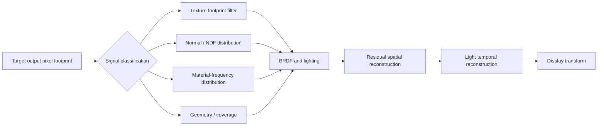

# Output-Aware Spatial Frequency Rendering (OSFR)

> A Unity rendering research project that moves anti-aliasing decisions upstream: from projected output-pixel footprints to signal-specific filtering before nonlinear shading.

[](Unity/ProjectSettings/ProjectVersion.txt)
[](Unity/Packages/manifest.json)
[](#project-status)
[](#validation)
[](LICENSE)

OSFR asks a practical question: **what if a renderer constrained each signal to the spatial frequency that the next sampling stage can actually represent?** Instead of relying on one post-process to repair every source of aliasing, OSFR separates texture, normal-distribution, material, geometry/coverage, and temporal signals and filters them in the domain where they are generated.

This repository contains the Unity 6 research implementation, deterministic validation scenes, automated measurement tooling, shaders, tests, and the original research plan.

## Why this project exists

Conventional solutions address different symptoms in isolation:

- texture mipmaps filter texture lookup, but not procedural material or geometric frequency;
- MSAA improves coverage edges, but not interior shader aliasing;
- TAA can stabilize motion, but may blur detail or fail at disocclusion;
- scene-color blur acts after nonlinear BRDF evaluation, when the missing distribution information is already lost.

OSFR's working invariant is:

> No subsystem should inject significant spatial frequency beyond what the next sampling stage can represent.

The project is testing whether that invariant can become a practical rendering-pipeline architecture rather than another isolated anti-aliasing stage.

## Pipeline direction



The important distinction is ordering: distributions are reconstructed **before** nonlinear shading, while spatial and temporal reconstruction handle only the residual error afterward.

## Current research status

| Stage | Question | Result |
|---|---|---|
| V0 — measurement | Can URP reconstruct world position, linear depth, and the anisotropic output-pixel footprint reliably? | Complete |
| V1 — residual reconstruction | Can an alias-risk-driven bilateral pass outperform raw rendering and native spatial AA without crossing depth/normal boundaries? | Qualified, with explicit TAA/disocclusion controls |
| V2 — normal distributions | Does filtering tangent-space slope covariance before GGX outperform scalar roughness broadening? | Qualified spatially and temporally |
| V2 — material distributions | Must unresolved roughness remain a distribution through BRDF evaluation? | Yes spatially; the current discrete mixture is not yet temporally promotable |
| V2 — texture and coverage | Can the same output-aware contract cover texture footprints and geometry/coverage? | Planned |

### Headline evidence

All percentages below compare candidates with Raw **within the same deterministic scene and reference policy**. Results from different rows are not cross-scene quality rankings.

| Experiment | Residual RMSE | Motion-compensated tRMSE | 2–30 Hz residual power | Decision |
|---|---:|---:|---:|---|
| V1 bilateral checkerboard | −55.75% | −59.51% | −46.75% | Promoted V1 reconstruction preset |
| V2 scalar normal-resultant, gain 64 | −73.26% | −72.91% | −98.56% | Qualified scalar baseline |
| V2 LEAN-like slope covariance | −73.85% | −68.12% | −95.57% | Promoted directional normal branch |
| V2 roughness distribution mixture | −68.85% | −72.03% | **+260.91%** | Correctness oracle; not temporally promoted |

The roughness result captures the present research frontier. A nine-sample BRDF mixture beats Raw on all 600 frames and 599 transitions, yet discrete sample-boundary changes raise temporal power. The next implementation is a phase-stable continuous footprint-coverage integral feeding a weighted two-lobe BRDF mixture.

Detailed methodology and complete result notes live in [the OSFR implementation guide](Unity/Assets/OSFR/README.md). The original proposal is preserved as [Deep Research Report — Resolution Aware Rendering](Documents/Deep%20Research%20Report%20-%20Resolution%20Aware%20Rendering.md).

## Quick start

### Requirements

- Git with [Git LFS](https://git-lfs.com/)
- Unity `6000.3.24f1`
- A graphics device supported by URP 17.3
- Windows is the currently qualified host platform; the source is not intentionally Windows-only

```powershell
git lfs install
git clone https://github.com/Xentiles/OSFR.git
cd OSFR
```

Open the [`Unity`](Unity/) directory from Unity Hub. The project uses Linear color space and URP Render Graph.

For a first inspection:

1. Open `Assets/OSFR/Validation/Scenes/V2_RoughnessFiltering.unity`.
2. Use **OSFR > Capture > Run V2 Roughness Distribution Smoke**.
3. Inspect the generated EXRs, CSV metrics, convergence record, and metadata under `Captures/V2` at the repository root.

Capture commands require a real graphics device; do not pass Unity's `-nographics` option.

## Validation

The current local release gate passes:

- 69 EditMode tests;
- 12 graphics-enabled PlayMode tests;
- deterministic scene and camera-rail construction;
- per-run immutable metadata;
- spatial-reference convergence records;
- full-frame, per-panel, motion-compensated, and frequency-domain metrics.

Run tests from Unity's Test Runner, or use the pinned editor directly:

```powershell
& 'C:\Program Files\Unity\Hub\Editor\6000.3.24f1\Editor\Unity.exe' `
  -batchmode -nographics -projectPath .\Unity `
  -runTests -testPlatform EditMode `
  -testResults .\Unity\TestResults\editmode.xml
```

See [`Unity/README.md`](Unity/README.md) for capture entry points and command-line details.

## Repository layout

```text
OSFR/
├─ Documents/                    Original plan and research report
├─ Unity/
│  ├─ Assets/OSFR/Runtime/       Render Graph features and metric math
│  ├─ Assets/OSFR/Shaders/       Measurement and experimental shaders
│  ├─ Assets/OSFR/Editor/        Scene builders and capture runners
│  ├─ Assets/OSFR/Validation/    Deterministic scenes and materials
│  └─ Assets/OSFR/Tests/         EditMode and PlayMode tests
└─ Captures/                     Generated evidence; intentionally ignored
```

Scientific captures are regenerated rather than committed. A full temporal qualification can exceed 10 GiB, so `Captures/`, `TestResults/`, Unity caches, and local intermediates are excluded from Git.

## Project status

OSFR is an active research prototype, not a drop-in production render pipeline. Current constraints include:

- experimental BRDFs are purpose-built controls, not full URP Lit replacements;
- the strongest results are from deterministic torture cases, not broad content suites;
- the roughness-distribution correctness oracle currently uses nine BRDF evaluations;
- reference captures are computationally and storage intensive;
- only the listed Unity/URP versions and Windows/NVIDIA development host have been qualified.

These limitations are kept visible because a negative result—such as lower spatial error but higher temporal power—is part of the evidence, not something to hide behind a single aggregate score.

## Roadmap

- Replace discrete roughness taps with continuous footprint coverage and a two-lobe mixture.
- Add resolution-aware texture-footprint filtering and anisotropic/EWA comparisons.
- Split geometry/coverage risk from shader-frequency risk and evaluate hybrid MSAA/coverage paths.
- Integrate signal-class outputs behind one runtime pipeline contract.
- Expand content, GPU, resolution, and motion coverage before claiming production readiness.

## Contributing and citation

Contributions that improve measurement rigor, reproduce results on other hardware, or extend a signal-class branch are welcome. Read [CONTRIBUTING.md](CONTRIBUTING.md) before opening a pull request and use [SECURITY.md](SECURITY.md) for vulnerability reports.

GitHub can generate citation metadata from [CITATION.cff](CITATION.cff). OSFR is available under the [MIT License](LICENSE).
